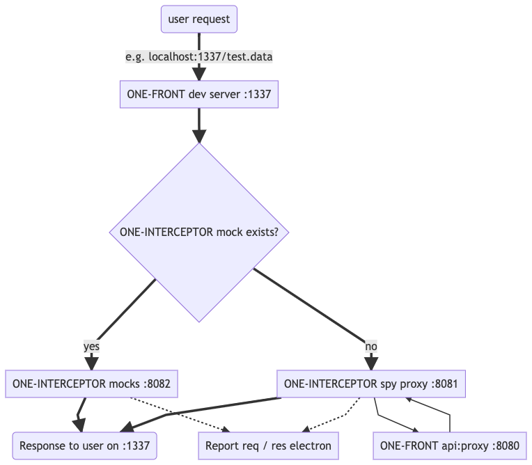

**NOTE**: This project uses [Electron React Boilerplate](https://electron-react-boilerplate.js.org/), built on Electron, React, Redux, React Router, Typescript, and Webpack. Go see their documentation for more information.

## Quickstart

Use `yarn dev` to get up and running.

Use `yarn package` to create a standalone executable application for your current system.

## Architectural Notes

`/app/` contains all the application code.

`/app/main.dev.ts` is the entry point for the electron application's main process

`/app/renderer/` contains all the traditionally "front-end" code: that is to say the renderer code

## Quick Overview

We create a mock server using dyson on port 8082, and a proxy server on 8081. Both servers communicate directly with the electron app, enabling the user to investigate the responses and edit the mocks.

The dev server for the ONE-front project (1337) should point towards 8082 rather than the normal 8080, but the ONE-front proxy should still be running on port 8080. In one-front/src/server/index.js, all occurances of 8080 should be replaced with 8082. (An MR is in the works to make this value based on a local.json value called `settings.api.useInterceptor`).

The pipeline for a request is basically:

- User makes a request to 1337
- 1337 asks 8082 (ONE-INTERCEPTOR mock) for the response
- 8082 checks if it has the mock
  - if it does, it returns the response to 1337 and records the req/res to the electron app
  - if not...
- 8082 forwards the request to 8081, the ONE-INTERCEPTOR spy proxy
- 8081 forwards the request to 8080, the ONE-FRONT dev server
  - it returns the response back up the pipeline to 1337 and records the req/res to the electron app

## To Do

- Look into publishing https://www.electron.build/configuration/publish
